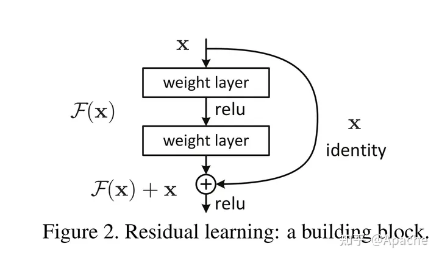

# Summmary
记录我的进度
---
description: 记录我的工作进度，不要摸鱼，加油前进！
最后更新时间：2023.0926

## ResNet的数学表示
假设某一层内，最优函数记为$H(x)$，那么我们所拟合的目标函数$F(x)$定义为$$F(x):=H(x)-x$$函数$F(x)$被称为“残差函数”。

由此可见，我们所需要的函数由两部分组成：恒等函数和残差函数。恒等函数的存在，避免了“负优化”问题，而残差函数则起到了“锦上添花”的作用。

这一做法基于这样的假设：最优函数与线性函数有较高的相似性，极端来看，若最优函数就是线性函数，那么我们的优化就会变得极为容易，因为F(x)的参数在初始化时接近于0，因此不会在训练过程中获取较大的梯度，因而不会影响恒等函数的表现。

因此，ResNet的基本架构就由如下图的残差块所组成。

残差块中的恒等函数部分，也被称为shortcut connection（or skip link)。
对应到神经网络中，残差块的数学表达式可以写成： $$y=\sigma(F(x,W)+x)$$
其中， 
 $y$代表残差块的输出， 
 $\sigma()$代表激活函数， 
 $F()$代表残差函数， 
 $x$代表输入， 
 $W$代表残差块内的所有权重。

当然，在全连接层中，如果$\sigma$项的维度与$x$不同，则可以用一个变换矩阵$W'$与$x$相乘（即对$x$做线性映射）；如果在卷积层中二者形状不同，则可以使用1*1卷积核（kernel）和zero-padding使得二者的维度与通道数相等。

## 残差块的代码实现（PyTorch）
    import torch
    from torch import nn
    from torch.nn import functional as F

    class Residual(nn.Module):
        def __init__(self, input_channels, num_channels, use_conv=False, strides=1):
            super().__init__()
            self.conv1 = nn.Conv2d(input_channels, num_channels,kernel_size=3, padding=1, stride=strides)
            self.conv2 = nn.Conv2d(num_channels, num_channels, kernel_size=3, padding=1)
            if use_conv:
                self.conv3 = nn.Conv2d(input_channels, num_channels, kernel_size=3, padding=1)
            else:
                self.conv3 = None
            self.bn1 = nn.BatchNorm2d(num_channels)
            self.bn2 = nn.BatchNorm2d(num_channels)
        
        def forward(self, X):
            FX = F.relu(self.bn1(self.conv1(X)))
            FX = self.bn2(self.conv2(FX))
            if self.conv3:
                X = self.conv3(X)
            FX += X
            return F.relu(FX)

